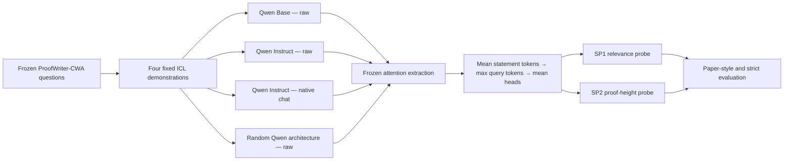

# Frozen-Qwen MechanisticProbe Experiment Report

**English** | [中文](EXPERIMENT_REPORT_ZH.md)

> Advisor-ready summary of the completed **reasoning-side** experiment. This study tests whether proof-relevant and proof-step information is decodable from frozen model attention, and whether instruction tuning or native chat formatting changes that representation. It does not yet test symbolic grounding itself.

## Executive summary

1. **Learned reasoning structure is present.** Under the strict theory-held-out split, Qwen2.5-7B Base and Instruct achieve SP1/SP2 kNN macro-F1 of `0.7184/0.8889` and `0.7122/0.8677`, well above the architecture-matched random control (`0.4980/0.5992`).
2. **Instruction tuning does not create a cleanly separated new reasoning stage.** Base and Instruct layer curves are very close. Base has a small SP1 advantage, while SP2 reverses direction between kNN and linear probes, which is more consistent with a rearrangement of representation geometry than a uniform gain or loss.
3. **Native chat formatting changes behavior more than decodability.** Within the same Instruct checkpoint, raw-to-chat kNN differences are statistically compatible with zero for both SP1 and SP2. Linear probes slightly favor chat, but end-task accuracy decreases from `76.10%` to `74.40%`.
4. **The result is evidence about reasoning-side representation, not grounding–reasoning separation.** SP1 is proof-relevance selection, not entity/predicate binding. Probe success is observational and does not establish causal use.

## Research question and experimental boundary

The long-term question is whether a language model's symbolic grounding step can be separated from its symbolic reasoning step. This experiment establishes the **reasoning half** by operationalizing the reasoning tree used in ProofWriter:

- **SP1 — useful-statement probe:** classify whether each context statement appears in the gold proof.
- **SP2 — proof-height probe:** among useful statements in depth-1 proofs, classify whether a statement is a fact-level or rule-level step.

The experiment can show that a frozen attention representation contains these labels. It cannot show that the model causally uses them, nor can it identify grounding-specific entity or predicate binding.

## Experimental design

| Component | Fixed setting |
| --- | --- |
| Dataset | Authors' processed ProofWriter-CWA test data |
| Formal sample | 6,277 questions; 85,820 statement-level rows |
| Statement-count buckets | 2, 4, 8, 12, 16, 20, 24 |
| Checkpoints | Qwen2.5-7B Base; Qwen2.5-7B-Instruct |
| Sanity control | Same Qwen architecture with random weights, seed 42 |
| Model training | None; every language-model weight is frozen |
| Prompting | Four fixed, label-balanced ICL demonstrations |
| Native-chat control | Default Qwen system message; four user/assistant demo pairs; final user question; assistant generation marker |
| Candidate scoring | Raw: `" True"`/`" False"`; native chat: `"True"`/`"False"` |
| Attention feature | One scalar per layer and statement using the paper's pooling order |
| Probes | 8-neighbor distance-weighted Manhattan kNN; balanced logistic regression |
| Paper-style split | Five-fold stratified statement-level CV, seed 42 |
| Strict split | Five-fold GroupKFold holding out complete theory contexts |
| Uncertainty | 1,000-replicate paired cluster bootstrap; complete theories for strict results |
| Compute | One 24 GB RTX 3090; BF16; models loaded one at a time |

The strict split is the primary result because statements derived from the same theory cannot occur in both training and test folds. The paper-style split is retained for methodological continuity.

## Primary results

### Strict-split kNN macro-F1

Brackets report 95% cluster-bootstrap confidence intervals.

| Condition | SP1 | SP2 | End-task accuracy |
| --- | ---: | ---: | ---: |
| Base (raw) | **0.7184** [0.7108, 0.7253] | **0.8889** [0.8786, 0.8991] | **0.7762** |
| Instruct (raw) | 0.7122 [0.7053, 0.7190] | 0.8677 [0.8570, 0.8777] | 0.7610 |
| Instruct (native chat) | 0.7155 [0.7086, 0.7223] | 0.8685 [0.8580, 0.8793] | 0.7440 |
| Random weights (raw) | 0.4980 [0.4939, 0.5021] | 0.5992 [0.5850, 0.6131] | 0.4913 |

The trained checkpoints' large margin over random weights supports the claim that the attention features encode learned proof relevance and proof-step structure. It does not by itself prove a procedural or causally used reasoning mechanism.

### Native model comparison: Base(raw) minus Instruct(chat)

Positive differences favor Base; negative differences favor native-chat Instruct.

| Task | Probe | Delta macro-F1 | 95% CI | Reading |
| --- | --- | ---: | ---: | --- |
| SP1 | kNN | +0.0029 | [-0.0016, 0.0069] | No reliable difference |
| SP1 | Linear | +0.0022 | [-0.0001, 0.0046] | No reliable difference |
| SP2 | kNN | +0.0204 | [0.0104, 0.0308] | Base is higher |
| SP2 | Linear | -0.0173 | [-0.0222, -0.0122] | Native-chat Instruct is higher |

The SP2 direction reversal means there is no defensible one-dimensional ranking of the two representations. The local neighborhood geometry and linear decision geometry changed differently.

### Pure prompt-format effect: Instruct(raw) minus Instruct(chat)

| Task | Probe | Delta macro-F1 | 95% CI | Reading |
| --- | --- | ---: | ---: | --- |
| SP1 | kNN | -0.0033 | [-0.0071, 0.0004] | Compatible with zero |
| SP1 | Linear | -0.0028 | [-0.0046, -0.0009] | Small advantage for chat |
| SP2 | kNN | -0.0008 | [-0.0103, 0.0080] | Compatible with zero |
| SP2 | Linear | -0.0076 | [-0.0116, -0.0036] | Small advantage for chat |

Chat formatting therefore has a small effect on frozen-feature decodability, while end-task accuracy changes by `-0.0170`. Behavioral accuracy and probe decodability must be reported separately.

## Comparison with Hou et al. (EMNLP 2023)

The source study is [*Towards a Mechanistic Interpretation of Multi-Step Reasoning Capabilities of Language Models*](https://aclanthology.org/2023.emnlp-main.299/) ([official code](https://github.com/yifan-h/MechanisticProbe)). It analyzes LLaMA-7B with four-shot prompting and a ProofWriter-supervised partially fine-tuned LLaMA.

The paper's main SP1/SP2 scores are normalized against a random model. To avoid mixing scales, the comparison below uses the paper's [**unnormalized kNN macro-F1 from Appendix Table 8**](https://aclanthology.org/2023.emnlp-main.299.pdf#page=18), which matches the metric reported in this repository. Values are percentages.

### SP2 raw macro-F1 by number of statements

| Statements | Paper LLaMA 4-shot | Paper LLaMAFT† | Qwen Base raw | Qwen Instruct raw | Qwen Instruct chat |
| ---: | ---: | ---: | ---: | ---: | ---: |
| 2 | 100.00 | 100.00 | 97.22 | 97.22 | 97.22 |
| 4 | 96.50 | 98.01 | 99.82 | 98.36 | 98.18 |
| 8 | 92.63 | 98.39 | 94.81 | 94.39 | 93.33 |
| 12 | 88.73 | 96.71 | 93.92 | 93.10 | 93.94 |
| 16 | 87.65 | 94.06 | 85.55 | 85.94 | 84.98 |
| 20 | 89.74 | 96.98 | 82.74 | 83.30 | 83.95 |
| 24 | 90.51 | 97.31 | 86.62 | 84.12 | 84.40 |

† `LLaMAFT` was partially fine-tuned with ProofWriter supervision. It is **not** analogous to Qwen2.5-Instruct, which received general instruction tuning and no training in this experiment.

The shared qualitative result is strong SP2 decodability across statement counts. The Qwen conditions are similar to or above four-shot LLaMA for 4–12 statements and lower for 16–24 statements. These are **descriptive cross-study differences**, not replication deltas: the original study sampled 1,024 test examples and pruned LLaMA layers, whereas this study freezes 6,277 questions and retains all 28 Qwen layers; the checkpoints, CV implementation, and training histories also differ. For SP1, both studies show deterioration as irrelevant statements increase, but a direct numeric table is omitted because this experiment's primary SP1 aggregate mixes depth-0 and depth-1 examples whereas the paper's bucketed Table 8 reports depth-1.

The paper further reports that layer-wise SP1 plateaus early and SP2 rises into middle layers. Our layer-prefix curves show the same broad ordering—large early SP1 gains and a more gradual SP2 rise—but the curves largely overlap across Base, raw Instruct, and native-chat Instruct.

## Visual results

### Layer-prefix curves

### Strict-split performance by statement count

## What the experiment establishes

- Frozen Qwen attention contains learned information about proof relevance and proof height.
- This information generalizes above random weights when complete theories are held out.
- Base and Instruct differ modestly; the difference is probe-geometry-dependent rather than a uniform improvement or degradation.
- Native chat formatting does not explain away the main representational pattern, although it reduces this fixed candidate-scoring task's accuracy.
- The present milestone provides an operational and reproducible **reasoning-side measurement** for a later grounding–reasoning separation study.

## What it does not establish

- **No grounding measurement:** SP1 does not test entity–predicate binding, symbol identity, or referential alignment.
- **No causal claim:** a probe can decode information the model does not use. Activation patching, ablation, or controlled interventions are required.
- **No direct model-capability ranking:** Base(raw) and Instruct(chat) change both checkpoint and format; SP2 also reverses across probe families.
- **No exact reproduction claim:** this is a conceptual reproduction with Qwen, a larger frozen sample, an added strict split, and no language-model fine-tuning.
- **Limited random baseline:** one random initialization is an architecture sanity check, not a variance estimate.

## Reproducibility and result links

- [Condensed numerical results](RESULTS.md)
- [Generated native-chat control report](results/chat-control/chat-control-summary.md)
- [Strict result JSON](results/chat-control/probe-chat-control-strict.json)
- [Paper-style result JSON](results/chat-control/probe-chat-control-paper.json)
- [Preflight hashes and length validation](results/chat-control/chat-control-baseline.json)
- [Postflight alignment and integrity validation](results/chat-control/chat-control-validation.json)
- [Native-chat runner](scripts/run_chat_control.sh)
- [Feature extraction and prompt rendering](src/mechanistic_probe/extract.py)
- [Control analysis](src/mechanistic_probe/chat_control_analysis.py)

## Recommended next experiment

Use the current SP1/SP2 pipeline as the reasoning measurement while adding a grounding-specific factorial intervention: consistently rename entities and predicates, swap bindings while preserving proof topology, and introduce unseen symbols. Cross these manipulations with proof depth and statement count, then use activation patching or attention ablation at layers implicated by the curves. A successful separation would require a selective dissociation—for example, a grounding intervention that changes binding-sensitive signals while preserving SP2, or a reasoning intervention that changes SP2 while preserving grounding-sensitive signals.
