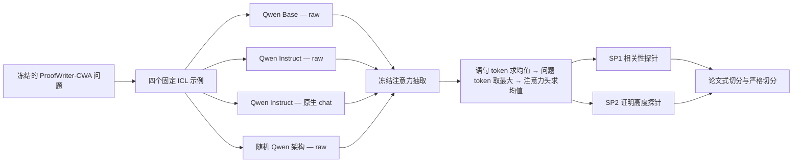

# 冻结 Qwen MechanisticProbe 完整实验报告

[English](EXPERIMENT_REPORT.md) | **中文**

本实验检验冻结模型的注意力中能否解码证明相关性与证明步骤信息，以及指令微调和原生 chat 格式是否改变这些表征。

## 研究问题与实验边界

语言模型的符号接地步骤能否与符号推理步骤分离。本实验通过 ProofWriter 的证明树定义并建立其中的**推理半边**：

- **SP1——有用语句探针：** 判断每条上下文语句是否出现在金标准证明中。
- **SP2——证明高度探针：** 对深度为 1 的证明中的有用语句，判断它处于事实层还是规则层。

本实验能够说明冻结注意力表征包含这些标签信息，但不能说明模型因果地使用这些信息，也不能识别 grounding 特有的实体或谓词绑定。

## 实验设计

| 组成部分 | 固定设置 |
| --- | --- |
| 数据集 | [原作者处理后的 ProofWriter-CWA 测试数据](https://huggingface.co/datasets/yyyyifan/MechanisticProbe_ProofWriter_ARC) |
| 正式样本 | 6,277 个问题；85,820 条语句级记录 |
| 语句数量分桶 | 2、4、8、12、16、20、24 |
| Checkpoint | Qwen2.5-7B Base；Qwen2.5-7B-Instruct |
| sanity control | 同 Qwen 架构的随机权重模型，seed 42 |
| 模型训练 | 无；所有语言模型权重均冻结 |
| Prompt | 四个固定、标签平衡的 ICL 示例 |
| 原生 chat 对照 | Qwen 默认 system；四组 user/assistant 示例；最终 user 问题；assistant generation marker |
| 候选评分 | raw：`" True"`/`" False"`；原生 chat：`"True"`/`"False"` |
| 注意力特征 | 按原论文池化顺序，为每层、每条语句得到一个标量 |
| 探针 | 8 邻居、距离加权、Manhattan kNN；类别平衡逻辑回归 |
| 论文式切分 | 语句级分层五折交叉验证，seed 42 |
| 严格切分 | 以完整 theory context 为组的五折 GroupKFold |
| 不确定性 | 1,000 次配对 cluster bootstrap；严格结果以完整 theory 为抽样单元 |
| 计算资源 | 单张 24 GB RTX 3090；BF16；模型逐个加载 |

严格切分是主要结果，因为来自同一 theory 的语句不会同时出现在训练折与测试折中。保留论文式切分是为了方法连续性。

## 主要结果

### 严格切分下的 kNN macro-F1

方括号内为 95% cluster-bootstrap 置信区间。

| 条件 | SP1 | SP2 | 端任务准确率 |
| --- | ---: | ---: | ---: |
| Base（raw） | **0.7184** [0.7108, 0.7253] | **0.8889** [0.8786, 0.8991] | **0.7762** |
| Instruct（raw） | 0.7122 [0.7053, 0.7190] | 0.8677 [0.8570, 0.8777] | 0.7610 |
| Instruct（原生 chat） | 0.7155 [0.7086, 0.7223] | 0.8685 [0.8580, 0.8793] | 0.7440 |
| 随机权重（raw） | 0.4980 [0.4939, 0.5021] | 0.5992 [0.5850, 0.6131] | 0.4913 |

训练过的 checkpoint 相比随机权重有较大优势，这支持“注意力特征编码了学习得到的证明相关性与证明步骤结构”。但这一结果本身不能证明模型采用了程序化推理，也不能证明该信息被因果使用。

### 原生模型比较：Base(raw) 减 Instruct(chat)

正值偏向 Base，负值偏向原生 chat Instruct。

| 任务 | 探针 | macro-F1 差值 | 95% CI | 解读 |
| --- | --- | ---: | ---: | --- |
| SP1 | kNN | +0.0029 | [-0.0016, 0.0069] | 无可靠差异 |
| SP1 | Linear | +0.0022 | [-0.0001, 0.0046] | 无可靠差异 |
| SP2 | kNN | +0.0204 | [0.0104, 0.0308] | Base 更高 |
| SP2 | Linear | -0.0173 | [-0.0222, -0.0122] | 原生 chat Instruct 更高 |

SP2 的方向反转意味着不能把两个表征排成一个简单的高低顺序：局部邻域几何与线性决策几何发生了不同变化。

### 纯 prompt-format 效应：Instruct(raw) 减 Instruct(chat)

| 任务 | 探针 | macro-F1 差值 | 95% CI | 解读 |
| --- | --- | ---: | ---: | --- |
| SP1 | kNN | -0.0033 | [-0.0071, 0.0004] | 与 0 相容 |
| SP1 | Linear | -0.0028 | [-0.0046, -0.0009] | chat 略高 |
| SP2 | kNN | -0.0008 | [-0.0103, 0.0080] | 与 0 相容 |
| SP2 | Linear | -0.0076 | [-0.0116, -0.0036] | chat 略高 |

因此，chat 格式对冻结特征可解码性的影响较小，而端任务准确率变化了 `-0.0170`。行为准确率与探针可解码性必须分开报告。

## 与 Hou 等人（EMNLP 2023）的比较

原研究为 [*Towards a Mechanistic Interpretation of Multi-Step Reasoning Capabilities of Language Models*](https://aclanthology.org/2023.emnlp-main.299/)（[官方代码](https://github.com/yifan-h/MechanisticProbe)）。论文分析了四样本提示的 LLaMA-7B，以及使用 ProofWriter 监督信号进行部分微调的 LLaMA。

论文主表中的 SP1/SP2 是相对于随机模型归一化后的分数。为避免混用量纲，下表采用论文[**附录 Table 8 的未归一化 kNN macro-F1**](https://aclanthology.org/2023.emnlp-main.299.pdf#page=18)，与本仓库报告的指标相同。数值单位为百分比。

### 不同语句数量下的 SP2 原始 macro-F1

| 语句数 | 原论文 LLaMA 4-shot | 原论文 LLaMAFT† | Qwen Base raw | Qwen Instruct raw | Qwen Instruct chat |
| ---: | ---: | ---: | ---: | ---: | ---: |
| 2 | 100.00 | 100.00 | 97.22 | 97.22 | 97.22 |
| 4 | 96.50 | 98.01 | 99.82 | 98.36 | 98.18 |
| 8 | 92.63 | 98.39 | 94.81 | 94.39 | 93.33 |
| 12 | 88.73 | 96.71 | 93.92 | 93.10 | 93.94 |
| 16 | 87.65 | 94.06 | 85.55 | 85.94 | 84.98 |
| 20 | 89.74 | 96.98 | 82.74 | 83.30 | 83.95 |
| 24 | 90.51 | 97.31 | 86.62 | 84.12 | 84.40 |

† `LLaMAFT` 使用 ProofWriter 监督信号进行了部分微调。它**不等同于** Qwen2.5-Instruct；后者只接受过通用指令微调，本实验没有进行任何训练。

两项研究共同的定性结果是：SP2 在不同语句数量下都具有较高可解码性。Qwen 各条件在 4–12 条语句时接近或高于四样本 LLaMA，在 16–24 条语句时较低。这些只是**跨研究描述性差异**，不是严格的复现差值：原研究随机抽取 1,024 个测试样本并剪除部分 LLaMA 层，而本实验冻结 6,277 个问题并保留 Qwen 的全部 28 层；checkpoint、交叉验证实现和训练历史也不同。对 SP1，两项研究都观察到无关语句增多时性能下降；但本文不提供直接数值表，因为本实验主要 SP1 汇总混合了 depth-0 与 depth-1 样本，而原论文 Table 8 的分桶结果只报告 depth-1。

原论文还报告：逐层 SP1 很早达到平台，而 SP2 持续上升到中间层。本实验的层前缀曲线呈现相同的大体顺序——SP1 在早期快速提升，SP2 上升更渐进——但 Base、raw Instruct 与原生 chat Instruct 的曲线大体重合。

## 可视化结果

### 层前缀曲线

### 严格切分下按语句数量分桶的结果

## 本实验能够建立的结论

- 冻结 Qwen 注意力中含有学习得到的证明相关性与证明高度信息。
- 当完整 theory 被隔离到测试折时，这些信息仍明显高于随机权重。
- Base 与 Instruct 的差异较小，并且依赖探针几何，不是统一的增强或削弱。
- 原生 chat 格式不能解释掉主要表征模式，但会降低当前固定候选评分任务的准确率。
- 当前里程碑为后续 grounding–reasoning 分离研究提供了可操作、可复现的**推理侧测量**。

## 本实验不能建立的结论

- **没有 grounding 测量：** SP1 不检验实体—谓词绑定、符号身份或指称对齐。
- **没有因果结论：** 探针可以解码模型未实际使用的信息；仍需 activation patching、ablation 或受控干预。
- **不能直接给模型能力排序：** Base(raw) 与 Instruct(chat) 同时改变 checkpoint 和格式，而且 SP2 在不同探针间方向反转。
- **不是严格逐项复现：** 这是使用 Qwen、更大冻结样本、新增严格切分且不微调语言模型的概念复现。
- **随机基线有限：** 单个随机初始化只是架构 sanity check，不是随机模型方差估计。

## 复现与结果链接

- [精简数值结果](RESULTS.md)
- [自动生成的原生 chat 对照报告](results/chat-control/chat-control-summary.md)
- [严格切分完整 JSON](results/chat-control/probe-chat-control-strict.json)
- [论文式切分完整 JSON](results/chat-control/probe-chat-control-paper.json)
- [预检哈希与长度验证](results/chat-control/chat-control-baseline.json)
- [运行后对齐与完整性验证](results/chat-control/chat-control-validation.json)
- [原生 chat 运行脚本](scripts/run_chat_control.sh)
- [特征抽取与 prompt 渲染](src/mechanistic_probe/extract.py)
- [对照分析代码](src/mechanistic_probe/chat_control_analysis.py)

## 建议的下一项实验

将当前 SP1/SP2 流水线作为推理测量，同时加入 grounding 专用的析因干预：一致地重命名实体与谓词、在保持证明拓扑不变时交换绑定、引入未见符号，并与证明深度和语句数量交叉。随后在层曲线指示的关键层进行 activation patching 或 attention ablation。真正的分离证据应表现为选择性双重分离，例如 grounding 干预改变绑定敏感信号但保持 SP2，或推理干预改变 SP2 但保持 grounding 敏感信号。
