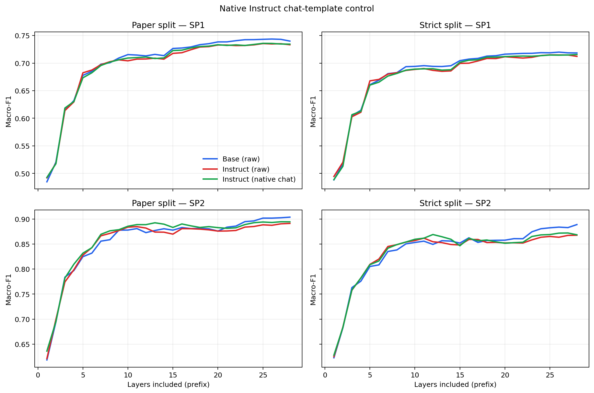
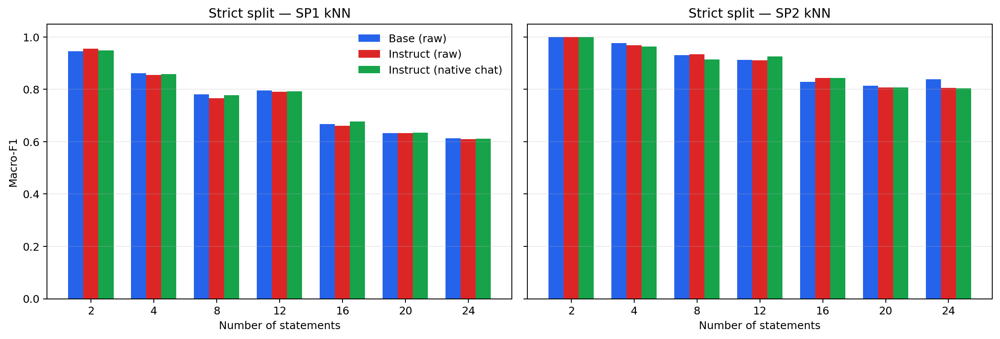

# 冻结 Qwen MechanisticProbe 复现实验

[English](EXPERIMENT_REPORT.md) | **中文**

原论文[*Towards a Mechanistic Interpretation of Multi-Step Reasoning Capabilities of Language Models*](https://aclanthology.org/2023.emnlp-main.299/) 及其[官方代码](https://github.com/yifan-h/MechanisticProbe)；[结果汇总](RESULTS.md)。

## 1. 摘要

> 近期工作已经表明，语言模型（LM）具有很强的多步（即程序性）推理能力。然而，目前尚不清楚，LM 完成这些任务时，是通过利用从预训练语料库中记住的答案来“作弊”，还是借助一种多步推理机制。在本文中，我们尝试通过探索 LM 在多步推理任务上的机制性解释来回答这一问题。具体而言，我们假设，LM 在其内部隐式嵌入了一棵类似于正确推理过程的推理树。我们通过提出一种新的探针方法（称为 MechanisticProbe）来检验这一假设，该方法从模型的注意力模式中恢复推理树。我们使用该探针分析两个语言模型：在合成任务（第 k 小元素）上的 GPT-2，以及在两个简单的基于语言的推理任务（ProofWriter 与 AI2 Reasoning Challenge）上的 LLaMA。我们表明，对于大多数样例，MechanisticProbe 能够从模型的注意力中检测出推理树的信息；这表明在许多情况下，语言模型的架构内部确实正在经历一个多步推理过程。

## 2. 原论文核心方法

### 2.1 用标准推理树表示多步推理

给定语句集合 $S=\{S_1,S_2,\ldots\}$ 和问题 $Q$，把正确推理过程表示为推理树 $G$，并提出核心假设：如果模型确实以类似标准的步骤进行推理，那么模型的注意力模式 $A$ 中应当能够恢复出 $G$。该问题被写成 $P(G\mid A)$。

### 2.2 把庞大的注意力张量压缩为语句级特征

完整注意力张量的规模为 $L\times H\times |T|^2$。为避免探针本身学习过强（如果把完整 attention 矩阵交给一个大型 MLP 或 Transformer probe，它可能利用这些统计模式直接预测答案或推理标签。），原论文依次进行以下简化（[论文第 3.2 节](https://aclanthology.org/2023.emnlp-main.299.pdf#page=3)）：

1. 对因果语言模型，首先聚焦于用于预测下一 token 的最后一个输入 token 的注意力，将特征规模降为 $L\times H\times |T|$。
2. 对所有注意力头取均值，将规模进一步降为 $L\times |T|$。
3. 在 ProofWriter 和 ARC 上，把每条自然语言语句视为一个超节点：对语句内部 token 的注意力取均值，对问题 token 取最大值，从而为每层、每条语句得到一个标量。
4. 对 LLaMA，作者保留完整模型的任务性能，然后只剪掉 probing 输入中的某些 attention layer 特征，观察剩余层是否仍足以恢复推理信息。ProofWriter 的 4-shot LLaMA 删除了 32 层中的 13 个顶层，LLaMAFT 删除了 2 个中间层和 16 个顶层，[附录 C.2](https://aclanthology.org/2023.emnlp-main.299.pdf#page=17)。GPT-2 的 head pruning（被剪掉的 head 输出被置为 0）

### 2.3 将推理树恢复拆成两个探针任务

原论文将树恢复分解为：

$$
P(G\mid A)=P(V\mid A)\,P(G\mid V,A),
$$

其中 $V$ 是标准推理树中的节点集合（所有真正参与推理的节点集合）（[论文第 3.3 节](https://aclanthology.org/2023.emnlp-main.299.pdf#page=4)）：

- **SP1：有用语句选择。** 二分类判断输入语句是否属于 $V$，即它是否出现在标准证明中。
- **SP2：推理树高度。** 在已知有用语句集合 $V$ 的条件下，分类每个有用语句在推理树中的高度，从而恢复树的步骤结构。

原论文使用非参数 kNN 探针，以 macro-F1 衡量两项分类任务，并以同架构随机初始化模型的注意力作为控制。论文主表报告的不是 raw macro-F1，而是相对随机基线归一化后的分数（真实模型的 attention 比随机模型的 attention 多提供了多少推理信息，v推理树中的有用节点集合，g- 完整的标准推理树
\(V\)）（[论文公式 1–2](https://aclanthology.org/2023.emnlp-main.299.pdf#page=5)）：

$$
SP1=\frac{F1(V\mid A)-F1(V\mid A_{rand})}{1-F1(V\mid A_{rand})},\qquad
SP2=\frac{F1(G\mid V,A)-F1(G\mid V,A_{rand})}{1-F1(G\mid V,A_{rand})}.
$$

## 3. 原论文的主要实验和核心结论

### 3.1 三类任务与模型

| 原论文任务 | 模型与设置 | 主要分析 |
| --- | --- | --- |
| 第 k 小元素 | GPT-2 与针对每个 k 单独微调的 GPT-2FT；默认从 16 个数中预测第 k 小值 | 注意力可视化、SP1/SP2、逐层分析，以及按注意力头熵进行剪枝的因果验证；|
| ProofWriter | LLaMA-7B 4-shot，以及用 ProofWriter 监督信号部分微调注意力参数的 LLaMAFT | 端任务准确率、SP1/SP2、逐层分析、探针分数与准确率/抗噪性的相关性；|
| ARC | LLaMA-7B 4-shot；因标注样本较少，不做微调模型分析 | SP1/SP2 与逐层分析；|

任务、模型和训练设置来自[论文第 2.2 节](https://aclanthology.org/2023.emnlp-main.299.pdf#page=2)及[附录 C.1](https://aclanthology.org/2023.emnlp-main.299.pdf#page=16)。ProofWriter 去除了循环、多证明标注和错误深度样例，并仅保留证明深度不超过 1 的样例，以规避深层证明树的结构歧义；清洗规则与数据量见[附录 C.3–C.4](https://aclanthology.org/2023.emnlp-main.299.pdf#page=17)。论文为效率从测试集随机抽取 1,024 个样例用于 LLaMA 探针分析。

### 3.2 原论文主结果

下表转录原论文 [Table 2](https://aclanthology.org/2023.emnlp-main.299.pdf#page=6) 的百分数。这里的 SP1/SP2 是相对随机模型归一化后的分数，而不是 raw macro-F1。

| 数据 / 深度 | 语句数 | 端任务准确率：LLaMA / LLaMAFT | SP1：LLaMA / LLaMAFT | SP2：LLaMA / LLaMAFT |
| --- | ---: | ---: | ---: | ---: |
| ProofWriter / 0 | All | 81.72 / 100 | 57.21 / 49.08 | — |
| ProofWriter / 1 | 2 | 94.81 / 100 | — | 100 / 100 |
| ProofWriter / 1 | 4 | 95.12 / 100 | 44.83 / 48.14 | 93.34 / 96.22 |
| ProofWriter / 1 | 8 | 92.19 / 100 | 27.39 / 40.09 | 83.75 / 96.44 |
| ProofWriter / 1 | 12 | 90.53 / 100 | 26.23 / 32.70 | 77.58 / 93.45 |
| ProofWriter / 1 | 16 | 89.55 / 100 | 17.18 / 21.07 | 77.85 / 89.31 |
| ProofWriter / 1 | 20 | 88.38 / 100 | 11.10 / 15.84 | 79.99 / 94.11 |
| ProofWriter / 1 | 24 | 86.13 / 100 | 9.39 / 17.33 | 80.32 / 94.42 |
| ARC / 1 | — | 56.32 / — | 97.49 / — | 61.73 / — |
| ARC / 2 | — | 55.41 / — | 96.49 / — | 53.40 / — |

据此，原论文得到以下主要观察：

- 在 ProofWriter 中，无关语句增多时，4-shot LLaMA 的 SP1 明显下降；SP2 仍保持较高，LLaMAFT 在 depth-1 各桶中的 SP1/SP2 总体高于 4-shot LLaMA。需要注意，depth-0 的 SP1 是明确例外：49.08 低于 57.21。
- 在 ARC 中，SP1 很高，SP2 中等；作者据此认为注意力中包含大量有用语句信息和一定的步骤信息。
- 逐层结果显示，ProofWriter 的 SP1 很早达到平台，而 SP2 持续增长到中间层；作者将其解释为先选择有用语句、再形成推理步骤。对应曲线见[论文 Figure 7–8](https://aclanthology.org/2023.emnlp-main.299.pdf#page=7)。
- 在 ProofWriter 上，作者重复 2,048 次子采样实验，报告端任务准确率与 SP1、SP2 的 Pearson 相关系数分别为 27.42% 和 71.13%；对一条无用语句加噪后，SP2 较高的样例也更稳健，见[论文 Table 3 与 Figure 10](https://aclanthology.org/2023.emnlp-main.299.pdf#page=8)。相关性本身不是因果性。
- 原论文的因果验证是对**第 k 小元素任务上的 GPT-2FT**进行注意力头剪枝：按与数值大小相关的注意力头指标剪枝会显著损害准确率，而位置相关头更冗余，见[论文第 5 节](https://aclanthology.org/2023.emnlp-main.299.pdf#page=8)。论文没有在 ProofWriter 的 LLaMA 上完成同等的头剪枝因果实验。

原作者最终将“多数样例的注意力中可以检测到金标准推理树信息”解释为语言模型可能在架构内部进行机制性的多步推理（见[论文结论](https://aclanthology.org/2023.emnlp-main.299.pdf#page=9)）。更严格地说，ProofWriter/ARC 部分主要提供可解码性、逐层模式和相关性证据；其中最直接的剪枝因果证据来自 GPT-2FT 合成任务。

## 4. 本复现实验与原论文实验的严格对比

### 4.1 逐项对比

| 维度 | Hou 等人原论文 | 本复现实验 | 可比性判断 |
| --- | --- | --- | --- |
| 研究范围 | 第 k 小元素、ProofWriter、ARC 三项任务 | 仅 ProofWriter-CWA，作为 grounding–reasoning 项目的“推理半边” | 只复现原方法在 ProofWriter 上的核心探针，不覆盖原论文全部实验 |
| 模型 | GPT-2/GPT-2FT；LLaMA-7B 4-shot；ProofWriter 监督微调的 LLaMAFT | 冻结的 [Qwen2.5-7B](https://huggingface.co/Qwen/Qwen2.5-7B)、[Qwen2.5-7B-Instruct](https://huggingface.co/Qwen/Qwen2.5-7B-Instruct) 和同架构随机权重模型 | Qwen Instruct 是通用指令模型，**不等同于**原论文的 ProofWriter 专项 LLaMAFT |
| 语言模型训练 | GPT-2FT 和 LLaMAFT 均进行任务训练；LLaMAFT 部分微调注意力参数 | 不微调任何语言模型；仅训练轻量探针 | Base–Instruct 不是对 LLaMA–LLaMAFT 的逐项复现 |
| ProofWriter 数据 | 原作者清洗并重分 depth；LLaMA 分析随机抽取 1,024 个测试样例 | 直接使用[原作者发布的 processed CWA](https://huggingface.co/datasets/yyyyifan/MechanisticProbe_ProofWriter_ARC)，冻结 6,277 个测试问题 | 数据来源与标签语义一致，样本集合和规模不同 |
| 深度 | ProofWriter 仅 depth 0/1 | 仅 depth 0/1；SP2 只使用 depth-1 的金标准有用语句 | 一致 |
| ICL prompt | 选择表现最好的 4-shot；简单 raw completion 模板 | 主实验也使用四个固定 raw completion demos；另补 Instruct 原生多轮 chat 对照 | raw 条件接近原模板；chat 是新增控制 |
| 注意力池化 | 语句 token 均值 → 问题 token 最大值 → 注意力头均值 | 相同顺序，见[特征抽取实现](src/mechanistic_probe/extract.py) | 核心特征构造一致 |
| 层处理 | 在开发集约束下剪层；ProofWriter 4-shot LLaMA 保留 19/32 层 | 保留 Qwen 的全部 28 层并绘制 layer-prefix 曲线 | 不同；本实验避免基于开发集选择层，但不复现原剪层步骤 |
| 探针 | kNN；主表报告随机归一化 SP1/SP2 | 8 邻居、距离加权、Manhattan kNN，并增加类别平衡逻辑回归；报告 raw macro-F1 | 只能用原论文附录 raw macro-F1 作描述性数值对照 |
| 切分 | 原论文报告抽样分析及其 kNN 结果 | “paper-style”为语句级 StratifiedKFold；主要结果为按完整 theory 隔离的 GroupKFold，均为五折 | 本实验切分更明确，但不是原论文切分的逐行复刻；实现见[探针代码](src/mechanistic_probe/probe.py) |
| 不确定性 | 主表未报告置信区间 | 1,000 次 cluster bootstrap；严格切分以完整 theory 为单元 | 本实验新增 |
| 端任务评分 | 下一 token 分类形式 | 比较 `True`/`False` 候选的平均 token log-probability，见[候选评分代码](src/mechanistic_probe/extract.py) | 均为固定候选评分，但 tokenizer、prompt 和模型不同，准确率不可直接横比 |
| 因果实验 | GPT-2FT 合成任务上做注意力头剪枝 | 未做 activation patching、attention ablation 或 head pruning | 本复现实验只能说明可解码性，不能声称因果使用 |

本实验的完整 formal 流水线见 [`run_formal.sh`](scripts/run_formal.sh)，chat 对照流水线见 [`run_chat_control.sh`](scripts/run_chat_control.sh)。

### 4.2 唯一可放在同一量纲下的跨研究数值对照

原论文主表是随机归一化分数，本实验报告 raw macro-F1，因此二者不能直接作差。下表改用原论文[附录 Table 8 的未归一化 SP2 kNN macro-F1](https://aclanthology.org/2023.emnlp-main.299.pdf#page=18)，并与本实验 paper-style 分桶 raw macro-F1 对照；单位均为百分比。

| 语句数 | 原论文 LLaMA 4-shot | 原论文 LLaMAFT | Qwen Base raw | Qwen Instruct raw | Qwen Instruct chat |
| ---: | ---: | ---: | ---: | ---: | ---: |
| 2 | 100.00 | 100.00 | 97.22 | 97.22 | 97.22 |
| 4 | 96.50 | 98.01 | 99.82 | 98.36 | 98.18 |
| 8 | 92.63 | 98.39 | 94.81 | 94.39 | 93.33 |
| 12 | 88.73 | 96.71 | 93.92 | 93.10 | 93.94 |
| 16 | 87.65 | 94.06 | 85.55 | 85.94 | 84.98 |
| 20 | 89.74 | 96.98 | 82.74 | 83.30 | 83.95 |
| 24 | 90.51 | 97.31 | 86.62 | 84.12 | 84.40 |

这些数字只支持一个稳健的共同定性观察：两项研究都能从注意力特征中较好地解码 depth-1 有用语句的高度。它们不是严格的模型排名，因为 checkpoint、训练历史、样本、层选择和交叉验证实现均不同。本文不制作 SP1 跨研究数值表：原论文 Table 8 的 ProofWriter 分桶 SP1 只对应 depth-1，而本实验公开的分桶 SP1 汇总包含 depth-0 与 depth-1，直接并列会混淆样本定义。

## 5. 本复现实验重要设计及其原因

### 5.1 为什么只复现 ProofWriter

本项目的总问题是能否把符号 grounding 与符号 reasoning 分离。本轮先建立可操作的**推理侧测量**：SP1 判断证明相关性，SP2 判断证明步骤高度。ProofWriter 同时提供自然语言事实/规则、真假答案和金标准证明树，因而可以在不微调语言模型的前提下直接构造这两个监督标签。第 k 小元素任务主要服务于原论文的合成机制与头剪枝验证；ARC 的原始数据没有证明树，原论文依赖额外人工标注且样本较少。基于本轮“冻结开源模型、单张 24 GB RTX 3090、不做语言模型微调”的目标，代码将范围明确限定为 ProofWriter reasoning-side milestone，见[项目范围说明](README.md#scope)与[数据准备实现](src/mechanistic_probe/prepare.py)。因此，这不是对原论文三个数据集的完整复现。

### 5.2 冻结样本、固定 demonstrations 与分桶

[`run_formal.sh`](scripts/run_formal.sh) 使用 seed 42，从原作者 processed CWA 的 test split 按语句数分桶，每桶最多选择 1,024 个问题；实际冻结样本如下：

| 语句数 | 2 | 4 | 8 | 12 | 16 | 20 | 24 | 合计 |
| ---: | ---: | ---: | ---: | ---: | ---: | ---: | ---: | ---: |
| 问题数 | 154 | 1,024 | 1,024 | 1,024 | 1,024 | 1,024 | 1,003 | 6,277 |

这产生 85,820 条语句级记录；实际桶计数也记录在[strict 结果 JSON 的 `task_accuracy.by_bucket`](results/chat-control/probe-chat-control-strict.json)中。分桶的目的不是复刻原论文的 1,024 总样本，而是在固定计算预算下覆盖不同干扰语句数量，检验语句增多时 SP1/SP2 是否退化。四个 ICL demonstrations 从 train split 中固定选取，要求语句数不超过 4，且按 True/False/True/False 平衡；这样既控制标签，又为最长 theory 保留上下文空间。选择逻辑见 [`_select_demos`](src/mechanistic_probe/prepare.py)。

### 5.3 为什么不微调语言模型，并加入随机权重模型

本轮目标是分析开源 checkpoint 中已经存在的表征，而不是通过 ProofWriter 训练创造该表征。因此 Base、Instruct 和 chat 条件的语言模型参数全部冻结；仅 kNN/逻辑回归探针拟合标签。随机模型复用 Qwen Base 的架构与 tokenizer，以 seed 42 初始化，用于判断探针是否只利用了架构、标签分布或数据规律。四个条件在 24 GB RTX 3090 上逐个加载；该 GPU 支持 BF16，实际 chat 元数据也记录为 `bfloat16`，见[产物元数据](results/chat-control/artifact-metadata/features-instruct-chat-formal.meta.json)。模型使用 eager attention、最大长度 2,048；模型加载、精度选择和冻结逻辑见 [`_load_model`](src/mechanistic_probe/extract.py)，正式运行顺序见 [`run_formal.sh`](scripts/run_formal.sh)。单个随机种子只是 sanity control，不估计随机初始化方差。

### 5.4 为什么同时保留 raw prompt 和原生 chat control

主实验让 Base 与 Instruct 接收完全相同的 raw completion prompt，便于控制输入文本；但 raw prompt 不是 Instruct checkpoint 的原生使用方式。为区分 checkpoint 差异和 prompt-format 效应，本实验只补跑一次 Instruct native chat：调用官方 `apply_chat_template`，保留默认 system message，把相同四个 demos 编成四组 user→assistant 消息，最终问题作为 user 消息，并设置 `add_generation_prompt=True`。raw 候选是带前导空格的 `" True"`/`" False"`，chat 候选是无前导空格的 `"True"`/`"False"`。渲染、span 对齐和候选定义见[实现](src/mechanistic_probe/extract.py)及[回归测试](tests/test_prompt_rendering.py)。

chat 流水线没有重新抽取 Base、raw Instruct 或 random。预检记录并保护旧样本和特征 SHA-256，运行后再次验证哈希、行顺序和金标签，见[预检基线](results/chat-control/chat-control-baseline.json)、[运行后验证](results/chat-control/chat-control-validation.json)和[验证代码](src/mechanistic_probe/validate_chat_control.py)。

### 5.5 为什么增加严格切分、线性探针和 bootstrap

- **严格 GroupKFold：** 同一 theory 会产生多条语句级记录；若这些语句跨训练/测试折，探针可能利用共享上下文。主要结果按完整 `theory_group` 隔离，paper-style 语句级分层五折仅用于延续原探针风格。两种切分见[代码](src/mechanistic_probe/probe.py)。
- **kNN + Linear：** kNN 对局部邻域几何敏感，逻辑回归检验线性可分性。两者方向若不一致，就不能把表征压缩成“更好/更差”的单一结论。
- **全部 28 层：** 本实验不根据端任务开发集剪层，而报告 layer-prefix 曲线，避免先选择“有用层”再探测同一结构；代价是与原论文的剪层 LLaMA 特征不完全相同。
- **1,000 次 cluster bootstrap：** 置信区间和成对差值在 paper-style 下以问题、严格切分下以完整 theory 为抽样单元；实现见[正式收尾脚本](scripts/finalize_formal.sh)和[探针 bootstrap 代码](src/mechanistic_probe/probe.py)。

## 6. 本复现实验结果

### 6.1 完整性与运行验收

| 检查项 | 结果 | 证据 |
| --- | --- | --- |
| 冻结问题 / 语句级记录 | 6,277 / 85,820 | [预检基线](results/chat-control/chat-control-baseline.json) |
| 四个固定 ICL demos | 通过 | [预检基线](results/chat-control/chat-control-baseline.json) |
| chat 全数据最大长度 | 482 tokens，低于 2,048 | [预检基线](results/chat-control/chat-control-baseline.json) |
| chat skipped | 0 | [运行后验证](results/chat-control/chat-control-validation.json) |
| 四条件行与金标签对齐 | 通过 | [运行后验证](results/chat-control/chat-control-validation.json) |
| formal 样本和 Base/raw-Instruct/random 旧产物哈希 | 运行前后不变 | [保护哈希](results/chat-control/chat-control-baseline.json)与[运行后验证](results/chat-control/chat-control-validation.json) |

三个 formal `.skipped.json` 的冻结 SHA-256 均为 `4f53cda1…f2054a`，即空 JSON 数组 `[]` 的哈希；chat 条件的验证文件则直接记录 `skipped_examples: 0`。因此四个条件均覆盖同一批 85,820 条语句记录。

### 6.2 严格切分的总体结果

为显示切分影响，先列出 paper-style 与严格切分的 kNN 点估计。paper-style 是语句级 StratifiedKFold；strict 是完整 theory 隔离的 GroupKFold。完整 paper-style 置信区间、Linear 结果和分桶结果见[正式结果汇总](RESULTS.md)与[chat paper JSON](results/chat-control/probe-chat-control-paper.json)。

| 条件 | paper SP1 | paper SP2 | strict SP1 | strict SP2 |
| --- | ---: | ---: | ---: | ---: |
| Base（raw） | 0.7399 | 0.9038 | 0.7184 | 0.8889 |
| Instruct（raw） | 0.7332 | 0.8913 | 0.7122 | 0.8677 |
| Instruct（native chat） | 0.7344 | 0.8945 | 0.7155 | 0.8685 |
| 随机权重（raw） | 0.5130 | 0.6299 | 0.4980 | 0.5992 |

严格切分下的 kNN 点估计全部低于对应 paper-style 值，说明把同一 theory 的语句隔离到同一折是实质性控制。以下将严格切分作为主要结果。方括号是 1,000 次 theory-cluster bootstrap 的 95% 置信区间；所有数字可由[正式结果汇总](RESULTS.md)和[chat strict JSON](results/chat-control/probe-chat-control-strict.json)复核。

| 条件 | SP1 kNN | SP1 Linear | SP2 kNN | SP2 Linear | 端任务准确率 |
| --- | ---: | ---: | ---: | ---: | ---: |
| Base（raw） | **0.7184** [0.7108, 0.7253] | **0.6692** [0.6648, 0.6732] | **0.8889** [0.8786, 0.8991] | 0.6447 [0.6301, 0.6578] | **0.7762** |
| Instruct（raw） | 0.7122 [0.7053, 0.7190] | 0.6643 [0.6603, 0.6682] | 0.8677 [0.8570, 0.8777] | 0.6544 [0.6400, 0.6672] | 0.7610 |
| Instruct（native chat） | 0.7155 [0.7086, 0.7223] | 0.6671 [0.6629, 0.6708] | 0.8685 [0.8580, 0.8793] | **0.6620** [0.6475, 0.6743] | 0.7440 |
| 随机权重（raw） | 0.4980 [0.4939, 0.5021] | 0.5061 [0.4994, 0.5121] | 0.5992 [0.5850, 0.6131] | 0.5185 [0.5036, 0.5339] | 0.4913 |

SP1 使用全部 85,820 条语句；SP2 仅使用 depth-1 证明中的 5,614 条金标准有用语句。三个使用训练后 checkpoint 的条件在两项任务上均高于同架构随机权重条件，说明这些冻结注意力特征含有训练后形成的证明相关性和步骤高度信息。但“可由探针解码”不等于模型在生成答案时因果地使用该信息。

### 6.3 Base 与 Instruct 的成对差异

正值表示第一项更高。下表均为严格切分、1,000 次配对 theory-cluster bootstrap；完整数字见[结果汇总](RESULTS.md)和[chat 对照 JSON](results/chat-control/probe-chat-control-strict.json)。

| 比较 | 任务 | 探针 | macro-F1 差值 | 95% CI |
| --- | --- | --- | ---: | ---: |
| Base(raw) − Instruct(raw) | SP1 | kNN | +0.0062 | [0.0019, 0.0105] |
| Base(raw) − Instruct(raw) | SP1 | Linear | +0.0049 | [0.0028, 0.0071] |
| Base(raw) − Instruct(raw) | SP2 | kNN | +0.0213 | [0.0117, 0.0307] |
| Base(raw) − Instruct(raw) | SP2 | Linear | −0.0097 | [−0.0133, −0.0059] |
| Base(raw) − Instruct(chat) | SP1 | kNN | +0.0029 | [−0.0016, 0.0069] |
| Base(raw) − Instruct(chat) | SP1 | Linear | +0.0022 | [−0.0001, 0.0046] |
| Base(raw) − Instruct(chat) | SP2 | kNN | +0.0204 | [0.0104, 0.0308] |
| Base(raw) − Instruct(chat) | SP2 | Linear | −0.0173 | [−0.0222, −0.0122] |

因此，不能概括为“Base 的推理表征整体优于 Instruct”。SP1 在 raw 对比中对 Base 有很小但置信区间不含 0 的优势；SP2 则出现探针依赖的方向反转：kNN 偏向 Base，Linear 偏向 Instruct。更准确的描述是，instruction tuning 伴随表征几何的轻微重排，而不是对单一“推理能力轴”的一致升降。

### 6.4 纯 prompt-format 效应

| 比较 | 任务 | 探针 | macro-F1 差值 | 95% CI |
| --- | --- | --- | ---: | ---: |
| Instruct(raw) − Instruct(chat) | SP1 | kNN | −0.0033 | [−0.0071, 0.0004] |
| Instruct(raw) − Instruct(chat) | SP1 | Linear | −0.0028 | [−0.0046, −0.0009] |
| Instruct(raw) − Instruct(chat) | SP2 | kNN | −0.0008 | [−0.0103, 0.0080] |
| Instruct(raw) − Instruct(chat) | SP2 | Linear | −0.0076 | [−0.0116, −0.0036] |

同一 Instruct checkpoint 内，chat 相对 raw 的 kNN 差异在 SP1/SP2 上都与 0 相容；Linear 则小幅偏向 chat。与此同时，端任务准确率从 0.7610 降到 0.7440，即描述性下降 0.0170。由此只能说，当前原生 chat 包装对注意力特征可解码性的影响很小，但会改变固定候选评分行为；不能把行为准确率和 probe decodability 当作同一个量。

### 6.5 分桶与逐层结果

在全部 Qwen 条件中，SP1 在前部层快速上升，SP2 更渐进地累积；这与原论文“相关语句选择较早、步骤信息随后形成”的大方向相符，但本实验没有剪层，而且三种训练 checkpoint 条件的曲线大体接近。因此这里只报告定性顺序，不声称逐层机制已经被严格复刻。

随着语句数增多，SP1 整体下降，符合更多无关语句使相关性选择更困难的解释；SP2 保持较高但并非单调。完整 paper/strict 数字、分桶值和 layer-prefix 数组分别见 [`probe-chat-control-paper.json`](results/chat-control/probe-chat-control-paper.json)与 [`probe-chat-control-strict.json`](results/chat-control/probe-chat-control-strict.json)。

## 7. 结论

本实验成功建立了 grounding–reasoning 分离研究的**推理侧观测量**：在不微调语言模型、完整 theory 严格隔离的条件下，冻结 Qwen2.5-7B Base 和 Instruct 的注意力特征都能明显优于同架构随机模型地解码金标准证明相关性（SP1）与 depth-1 证明步骤高度（SP2）。这一结果与 Hou 等人“注意力中包含推理树信息”的核心观察一致，但不能升级为“模型一定按金标准证明树进行因果推理”。

Base 与 Instruct 没有统一的胜负关系。Base 在 kNN SP2 上更高，Instruct 在 Linear SP2 上更高；原生 chat 对照没有消除这一方向反转。因而当前证据更支持 instruction tuning 改变了表征几何，而不支持“指令微调统一增强/削弱符号推理”的标量结论。端任务准确率同样受 prompt 和候选 token 化影响，不能单独作为内部推理结构的证据。

本实验也**没有完成 grounding–reasoning 的最终分离**：SP1 测量的是证明相关性，不测量实体—谓词绑定、符号身份或指称对齐；本实验没有 grounding 标签，也没有 activation patching、ablation 或注意力头剪枝。因此可接受的最终表述是：当前工作复现并加强了 MechanisticProbe 的 ProofWriter 推理侧测量，增加了严格 theory 切分、随机权重控制、第二类探针、配对置信区间和原生 chat 控制；下一阶段仍需在保持证明拓扑不变的情况下操纵实体/谓词绑定，并以因果干预检验 grounding 信号与 SP2 是否可选择性分离。
